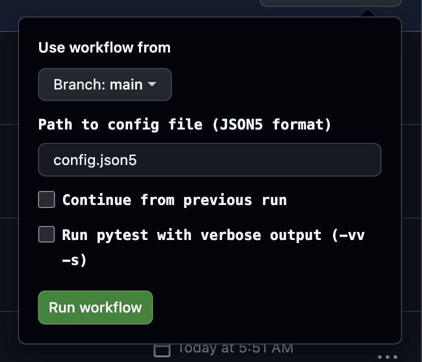

# invenio-testrig

This repository provides tools for verifying patches for invenio libraries.

## Usage

0. Fork this repository to your own GitHub account.

1. Modify the base config if needed (mostly the repositories section of the config.yaml), no need to add any patches yet.

2. Commit and push your changes to your fork.

3. Go to the Actions tab and start the "Create verification" workflow:

   - Click on the "Create verification" workflow.
   - Click "Run workflow".
   - **Select the correct branch.**
   - Add patches that should be applied to the packages. You can add patches for multiple packages, and you can also add multiple patches for the same package (if using upstream or pinned mode). The workflow will automatically rebase/cherry-pick the patches as needed. See below for patch syntax.
   - Select any other options if needed (python version, run black, patch mode etc.)
   - Click "Run workflow" to start the verification.

   


4. Wait for the workflow to finish.

5. Navigate to the [generated report](./reports/reports.md).

6. If you need to re-run the workflow (for example, after updating a PR or testing a different Python version), just run the "Run verification" workflow, selecting the same branch and updating parameters as needed.

## Configuration

The `config.yaml` file controls how the testrig operates. Below are the main sections with examples.

### Patches

Define the patches to apply to packages. Patches can be branches, PRs, or specific commits from any repository.

**Testing without patches:**

If you don't specify any patches (empty list or omit the section), tests will run for all packages matching the `github` filters without applying any patches. This is useful for baseline testing.

```yaml
patches:  # Empty - just test all packages as-is
```

**Basic syntax:**

```yaml
patches:
  - invenio-records-resources#1234        # Use a pull request
  - myorg/invenio-rdm-records@my-feature  # Use a fork and branch
  - citeproc-py: myorg/citeproc-py-styles@fix    # Custom package name
```

**Version ranges** - Apply patches conditionally based on installed version:

```yaml
patches:
  - invenio-base#234>=2.0.0              # Only apply if base version is >=2.0.0
  - invenio-db@fix>=1.5,<2.0             # Only apply to v1.5.x versions
```

**Multiple patches** for the same package (requires upstream or pinned mode):

```yaml
patches:
  - invenio-db#123                        # First PR
  - invenio-db#456                        # Second PR (cherry-picked on top)
```

### GitHub Configuration

Specify which packages to test from GitHub organizations. Normally you
do not need to change this, but you can use it to limit testing to specific packages.

```yaml
github:
  - org: "inveniosoftware"
    include:
      - "invenio-.*"                      # Test all invenio packages
    exclude:
      - "invenio-xrootd"                  # Skip specific packages
      - "invenio-swh"
    branch: main                          # Branch for upstream mode (optional)
```

**Multiple organizations:**

```yaml
github:
  - org: "inveniosoftware"
    include: ["invenio-.*"]
    branch: main
  - org: "oarepo"
    include: ["oarepo-.*"]
    branch: develop
```

### Repository Configuration

Define the main repository to install and test. The repository is used to extract dependencies and optionally run e2e tests.

```yaml
repository:
  # Repository to install - dependencies will be extracted from it
  git: zenodo/zenodo-rdm@master
  
  # E2E test configuration (optional)
  e2e: oarepo/invenio-e2e@log-xhr
```

**Without e2e tests:**

```yaml
repository:
  git: zenodo/zenodo-rdm@master
  e2e:  # Leave empty or do not include to skip e2e tests
```

### Patch Model

The patch model determines how patches are applied and tested. Choose based on your testing scenario:

#### `as-is` (Default)

**Use when:** Testing a specific fix or feature branch exactly as it is.

- Uses the exact branch/PR specified in your patches
- No rebasing or cherry-picking
- Only allows one patch per package
- **Best for:** Verifying that your PR/branch works if it was merged as-is, without rebasing
- **Example scenario:** You have a fix for invenio-db in a branch called `fix-transaction-bug` 
  and want to test it exactly as it is
- **Note:** If other packages have dependencies on the patched package, they will be tested with the exact patched version of the package

```yaml
patch_mode: as-is
patches:
  - invenio-db@fix-transaction-bug    # Tests this exact branch
```

#### `upstream`

**Use when:** Testing your patches against the latest upstream development branch.

- Rebases your patches onto the current upstream branch (configured in `github.branch`)
- Allows multiple patches per package (cherry-picked in order) so that we can test the combined effect of multiple PRs
- **Best for:** Ensuring your fix works with the latest upstream changes before merging
- **Example scenario:** You have a fix for invenio-db, but want to test it against the latest `master` branch
- **Note:** The upstream version may be different from the version installed from `repository.git`

```yaml
patch_mode: upstream
github:
  - org: "inveniosoftware"
    include: ["invenio-.*"]
    branch: master                      # Test against latest master
patches:
  - invenio-db#123                    # Your fix, rebased onto master
  - invenio-records-resources#456     # Another fix, also rebased onto master
```

#### `pinned`

**Use when:** Backporting fixes to a specific release of a repository.

- Rebases your patches onto the exact versions installed from `repository.git`
- Allows multiple patches per package (cherry-picked in order)
- **Best for:** Testing backports or fixes for a specific release/deployment
- **Example scenario:** Zenodo runs invenio-db v1.2.3, and you need to verify your backported 
  fix works with that exact version

```yaml
patch_mode: pinned
repository:
  git: zenodo/zenodo-rdm@v12.0.0      # Use Zenodo v12 dependencies
patches:
  - invenio-db#123                    # Rebased onto invenio-db v1.2.3 (from Zenodo v12)
```

**Comparison:**

| Mode | Base Version | Multiple Patches | Use Case |
|------|-------------|------------------|----------|
| `as-is` | Exact patch branch/PR | ❌ No | Test isolated changes |
| `upstream` | Latest upstream branch | ✅ Yes | Test against latest development |
| `pinned` | Production/release version | ✅ Yes | Test for specific deployment |

#### On the background

if we have:

```yaml
repository:
  git: zenodo/zenodo-rdm@v12.0.0 
        - depends on invenio-db v1.2.3
patches:
   - invenio-db#123 (myorg/invenio-db, branch bugfix)
```

If maintrunk of invenio-db is at v2.0.0, then:

*as-is*:

```bash
gh repo clone zenodo/zenodo-rdm@v12.0.0
uv sync  # installs invenio-db v1.2.3
uv pip install myorg/invenio-db@bugfix  # replace the installed invenio-db with bugfix branch
```

*upstream*:

```bash
gh repo clone zenodo/zenodo-rdm@v12.0.0
uv sync  # installs invenio-db v1.2.3
gh repo clone inveniosoftware/invenio-db@master  # clone latest invenio-db
cd invenio-db; git cherry-pick from PR 123 # clone master and cherry-pick the PR
cd zenodo-rdm; uv pip install ../invenio-db  # version 2.0.0 with the patch will be used for testing
```

*pinned*:

```bash 
gh repo clone zenodo/zenodo-rdm@v12.0.0
uv sync  # installs invenio-db v1.2.3
gh repo clone inveniosoftware/invenio-db@v1.2.3  # clone the exact version used by zenodo
cd invenio-db; git cherry-pick from PR 123 # cherry-pick the PR on top of the exact version used by zenodo
cd zenodo-rdm; uv pip install ../invenio-db  # version 1.2.3 with the patch will be used for testing
```

### Hooks

Hooks allow you to run custom bash commands at specific points in the workflow. All hooks are optional and can be used for tasks like setting environment variables, modifying configuration, or preparing test data.

**Setting environment variables:**

If your hook creates a `.env` file, it will be sourced after the hook runs, allowing you to set environment variables for subsequent steps.

```yaml
hooks:
  after-uv-sync: |
    echo "CUSTOM_VAR=value" > .env
    echo "DEBUG=true" >> .env
```

**Available hooks:**

```yaml
hooks:
  # After loading config file
  after-config-preprocessing: echo "Config loaded"
  
  # Before/after cloning repository.git
  before-repository-checkout: echo "Preparing to clone"
  after-repository-checkout: echo "Repository cloned"
  
  # After installing dependencies
  after-uv-sync: |
    echo "Dependencies installed"
    pip install additional-tool
  
  # After extracting packages to test
  after-package-extraction: echo "Found $PACKAGE_COUNT packages"
  
  # Before/after applying patches (runs for each patch)
  before-cherry-pick: echo "Applying patch to $PACKAGE_NAME"
  after-cherry-pick: |
    # Run code formatter after patching
    black .
  
  # Before/after running tests
  before-tests: echo "Starting tests for $PACKAGE_NAME"
  after-tests: echo "Tests complete"
  
  # Before/after e2e tests
  before-e2e-tests: echo "Starting e2e tests"
  after-e2e-tests: echo "E2E tests complete"
```

**Example use cases:**

- **Install additional tools:** Use `after-uv-sync` to install testing tools or linters
- **Configure services:** Use `before-tests` to start required services (Redis, PostgreSQL)
- **Format code:** Use `after-cherry-pick` to run code formatters on patched code
- **Custom validation:** Use `after-tests` to run additional checks or upload results
- **Set environment variables:** Create `.env` file to configure behavior of subsequent steps

### Timeout

Set the maximum time for testing each package:

```yaml
test_timeout: 90  # Minutes
```

### Complete Example

```yaml
name: "test-my-fixes"

patches:
  - invenio-db@fix-transaction-handling
  - invenio-records-resources#2345>=3.0.0
  - invenio-rdm-records#789

github:
  - org: "inveniosoftware"
    include: ["invenio-.*"]
    exclude: ["invenio-xrootd", "invenio-swh"]
    branch: master

repository:
  git: samk13/invenio-dev-latest@master
  e2e: oarepo/invenio-e2e@main

patch_mode: as-is
test_timeout: 120
```

## How it works

The CI pipeline performs the following steps:

1. **Extract packages**: Clone the repository specified in `repository.git` and extract all dependencies matching the patterns in the `github` section from its lock file. The package list is stored as an output for use in the subsequent matrix build steps.

2. **Test each package** (runs in parallel as a matrix build):
   a. **Set up environment**: Clone `repository.git` and create a virtual environment using `uv sync`. This installs all dependencies including the package to be tested.
   b. **Apply patches**: For each package being tested that has patches in `config.yaml`, apply the patches according to the patch_mode:
      - **as-is mode**: Install the exact patched branch/PR over the installed version
      - **upstream mode**: Clone the upstream branch, cherry-pick the patch commits, and install the result
      - **pinned mode**: Clone the exact version from `repository.git`, cherry-pick the patch commits, and install the result
   c. **Run tests**: Execute the test suite for the package using the `run-tests.sh` script.
   d. **Compare results** (if needed): If tests fail and "Run original tests" is enabled, run tests without patches to compare results.
   e. **Store artifacts**: Save test outputs and diffs as artifacts.

3. **Generate report**: Create a summary report of all tested packages, indicating which patches fixed issues, which introduced regressions, and which had no effect.
